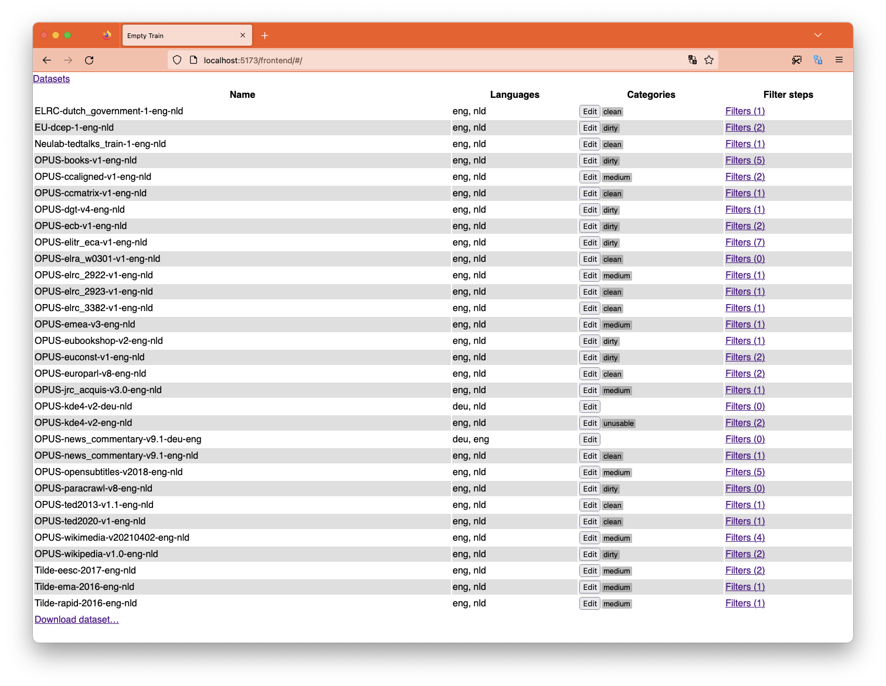
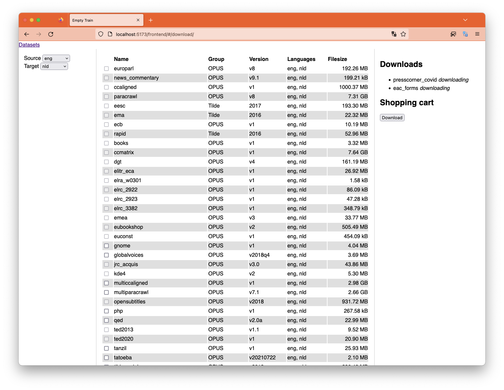
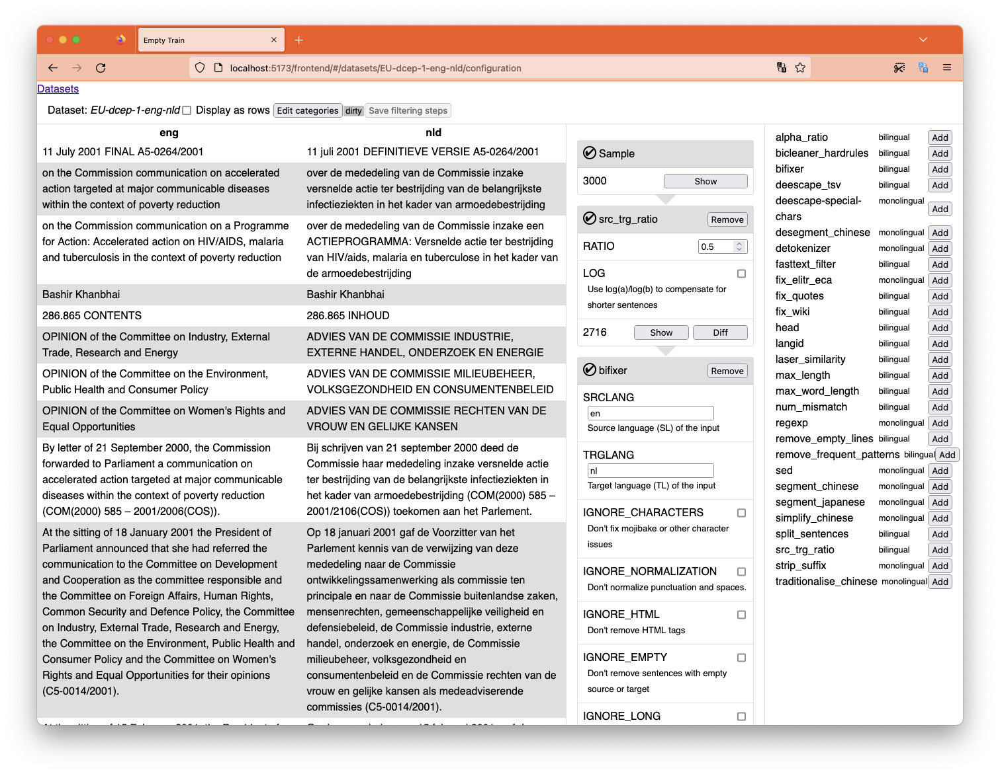
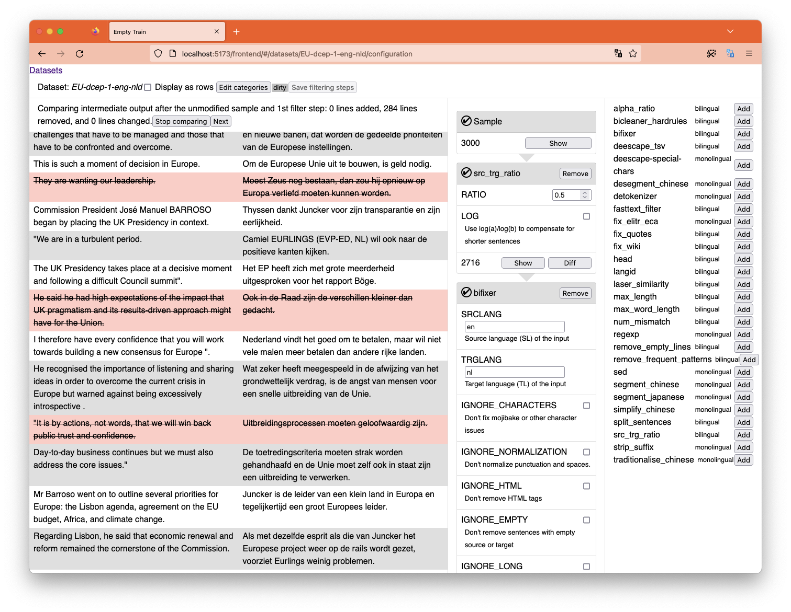

# Empty-train
Empty train is a machine translation/language model data cleaner and training scheduler. The Training scheduler has moved to [empty-trainer](https://github.com/hplt-project/empty-trainer).

## Cleaner
The cleaner bit takes care of downloading and cleaning multiple different datasets and preparing them for translation.

### Dependencies
(Mainly listed as shortcuts to documentation)

- [FastAPI](https://fastapi.tiangolo.com) as the base for the backend part.
- [Pydantic](https://pydantic-docs.helpmanual.io/) for conversion of untyped JSON to typed objects. And because FastAPI automatically supports it and gives you useful error messages if you mess up things.
- [Vue](https://vuejs.org/guide/introduction.html) for frontend

### Screenshots

List and categorize the datasets you are going to use for training.
[](.github/screenshots/list-datasets.png)

Download more datasets right from the interface.
[](.github/screenshots/add-datasets.png)

Filter each individual dataset, showing you the results immediately.
[](.github/screenshots/filter-datasets.png)

Compare the dataset at different stages of filtering to see what the impact is of each filter.
[](.github/screenshots/diff-filter-output.png)


### Paths
- `data/train-parts` is scanned for datasets
- `filters` should contain filter json (but that's not implemented yet, right now it just has a hard-coded `FILTERS` dict in code)

### Installation for development
```sh
python3 -m venv .env
bash --init-file .env/bin/activate
pip install -r requirements.txt

cd frontend
npm clean-install
npm run build
cd ..

./main.py serve --reload
```

If you're doing frontend development, try also running:
```sh
cd frontend
npm run dev
```

This will put vite in hot-reloading mode for easier javascript dev. All api requests will be proxied to the `main.py serve` running in 8000.

If you want to use LASER, you will also need to download its assets:

```sh
python -m laserembeddings download-models
```

Then go to http://127.0.0.1:8000/ for the "interface" or http://127.0.0.1:8000/docs for the API.

# Acknowledgements

This project has received funding from the European Union’s Horizon Europe research and innovation programme under grant agreement No 101070350 and from UK Research and Innovation (UKRI) under the UK government’s Horizon Europe funding guarantee [grant number 10052546]

